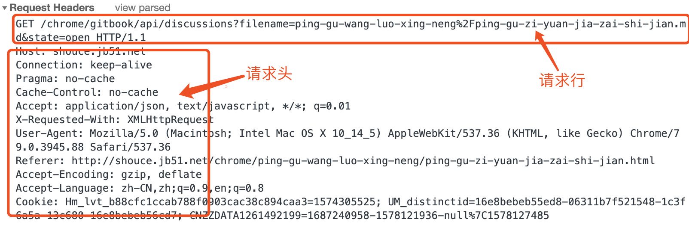

### 什么是协议

网络协议是计算机之间为了实现网络通信而达成的一种“约定”或者”规则“，有了这种”约定“，不同厂商的生产设备，以及不同操作系统组成的计算机之间，就可以实现通信。

<!-- more -->

### 什么是 HTTP 协议？

Web 是建立在 http 协议上通信的。
HTTP 协议是超文本传输协议的缩写，英文是 Hyper Text Transfer Protocol。它是从 WEB 服务器传输超文本标记语言(HTML)到本地浏览器的传送协议。

设计 HTTP 最初的目的是为了提供一种发布和接收 HTML 页面的方法。通过 HTTP 或者 HTTPS 协议请求的资源由统一资源标识符（Uniform Resource Identifiers，URI）来标识。

HTPP 有多个版本，目前广泛使用的是 HTTP/1.1 版本。

### HTTP 协议的特点

- 简单快速:客户向服务器请求服务时，只需传送请求方法和路径，请求方法最常用的有 GET，HEAD，POST，PUT，DELETE.每种方法规定了客户与服务器联系的类型不同，由于 HTTP 协议简单，使得 HTTP 服务器的程序规模小，因而通信速度很快。
- 灵活:HTTP 允许传输任意类型的数据对象。传输的类型由 Content-Type 加以标记。
- 无连接:无连接的含义是限制每次链接只处理一个请求，服务器处理完客户的请求，并收到客户的应答后，即断开连接，采用这种方式可以节省传输时间
- 无状态:HTTP 协议是无状态的，HTTP 协议自身不对请求和响应之间的通信状态进行保存，任何两次请求之间都没有依赖关系。直观的说，就是每个请求都是独立的。与前面的请求和后面的请求都是没有直接联系的。协议本身并不保留之前一切的请求或响应报文的信息，这是为了更快的处理大量事务，确保协议的可伸缩性，而特意把 HTTP 协议设计成如此简单的

  

### HTTP 报文的构成

HTTP 报文分两部分：请求报文和响应报文。

- 请求报文分为:
  - 请求行：包括请求方法、URL、协议/版本
  - 请求头由关键字/值对组成，每行一对，关键字和值用英文冒号":"分隔
  - 请求头部通知服务器有关客户端请求的信息，它包含许多有关的客户端环境和请求正文的有用信息 。比如：
  - Host:主机名，虚拟主机
  - Connection：HTTP/1.1 增加的，使用 keepalice，即持久链接，一个链接可以发多个请求
  - User-Agent：请求发出者，兼容性及定制化需求
  - 空行,最后一个请求头之后是一个空行，这个行非常重要，它表示请求头已经结束，接下来的是请求正文
  - 请求体，可以承载多个请求参数的数据
- 响应报文分为：状态行、消息报头、响应正文。

客户端请求：

服务器应答：

在 HTTP1.0，单一 TCP 连接内仅执行一个“客户端发送请求—服务器发送应答”周期，之后释放 TCP 连接。在 HTTP1.1 优化支持持续活跃连接：客户端连续多次发送请求、接收应答；批量多请求时，同一 TCP 连接在活跃（Keep-Live）间期内复用，避免重复 TCP 初始握手活动，减少网络负荷和响应周期。此外支持应答到达前继续发送请求（通常是两个），称为“流线化”（stream）。

### HTTP 的请求方法

HTTP/1.1 协议中共定义了八种方法（也叫“动作”）来以不同方式操作指定的资源：

1. GET：发送一个请求来取得服务器上的某一资源。
2. HEAD：类似于 get 请求，只不过返回的响应中没有具体的内容，用于获取报头。
3. POST：向 URL 指定的资源提交数据或附加新的数据
4. PUT：从客户端向服务器传送的数据取代指定的文档的内容。
5. DELETE：DELETE 方法删除指定的资源。
6. TRACE：回显服务器收到的请求，主要用于测试或诊断，TRACE 方法沿着到目标资源的路径执行一个消息环回测试。
7. OPTIONS：这个方法可使服务器传回该资源所支持的所有 HTTP 请求方法。用'\*'来代替资源名称，向 Web 服务器发送 OPTIONS 请求，可以测试服务器功能是否正常运作。
8. CONNECT：HTTP/1.1 协议中预留给能够将连接改为管道方式的代理服务器。通常用于 SSL 加密服务器的链接（经由非加密的 HTTP 代理服务器）。CONNECT 方法建立一个到由目标资源标识的服务器的隧道。

### GET 和 POST 的区别：

单独拿出详细介绍：[get 和 post 的区别](./defer_post_get.md)

### HTTP 返回的状态码

响应分为五类：信息响应(100–199)，成功响应(200–299)，重定向(300–399)，客户端错误(400–499)和服务器错误 (500–599)。

- 1XX: 表示成功接受请求，要求客户端继续提交下一次请求才能完成整个处理过程
- 2XX: 表述成功接受请求并已完成整个处理过程

  - 200 ok 客户端请求成功

- 3XX: 重定向，需要进一步的操作以完成请求。

  - 301 永久重定向，被请求的资源已永久移动到新位置，并且将来任何对此资源的引用都应该使用本响应返回的若干个 URI 之一。
  - 302 Found 临时性重定向，指出请求的文档已被临时移动到别处，此文档的新的 url 在 location 响应头中给出
  - 304 Not Modified 未修改 表示客户端缓存的版本是最新的，客户端应该继续使用它

- 4XX: 客户端错误，请求包含语法错误或无法完成请求。
  - 400 请求报文存在语法错误，或者请求参数有误。
  - 401 未授权，登陆失败，发送的请求需要通过 HTTP 认证的认证信息。如果之前请求过一次，则表示用户认证失败
  - 403 禁止访问，服务器理解客户端请求，但拒绝处理它，通常用于服务器上文件或目录的权限设置所致
  - 404 服务器上找不到该资源
- 5XX: 服务器端错误，服务器在处理请求的过程中发生了错误。
  - 500 服务器端在执行请求时发生错误
  - 503 服务器暂时处于超负载或正在停机维护，无法处理请求

### 持久链接

在 HTTP 0.9/1.0 中，每次请求都要建立/断开一次 TCP 连接，当页面需要多次请求的时候，就增加了很多开销：

于是在 HTTP 1.1 中，引入了持久连接的机制，一个连接可以重复在多个请求/回应使用。持久连接的方式可以大大减少等待时间，因为在发出第一个请求后，双方不需要重新运行 TCP 握手流程：

#### 为什么需要持久链接？

HTTP 协议的初始版本中，每进行一次 HTTP 通信就要断开一次 TCP 链接。以前由于传输文本很小，所以这样没有太大问题，随着普及，请求 HTML 页面资源的同时，也请求文档中包含大量图片和其他资源，因此，每次的请求都会造成无谓的 TCP 链接建立和断开，增加通信量的开销。

#### 持久链接的特点

当使用 Keep-alive 模式（又称持久连接，连接重用 http1.1 的版本才支持）时，Keep-alive 功能使客户端到服务端的连接持续有效，当出现服务器的后续请求时，Keep-alive 避免了建立或者重新建立连接。
持久链接的特点是：只要任意一端没有明确提出断开连接，则保持 TCP 链接状态
持久链接的好处在于减少了 TCP 链接的重复建立和断开所造成的额外开销，减轻了服务器端的负载，另外，减少开销的那部分时间，使 HTTP 请求和响应能够跟早的结束，这样 web 页面的显示速度也就相应提高了
在 HTTP/1.1 中，所有的链接默认都是持久链接，但在 HTTP/1.0 内并未标准化

#### 管线化（pipelining）

虽然持久连接减少了 TCP 连接，但是一个一个的请求和接收还是太慢，于是有了管线化：

管线化是将多个 HTTP 请求（request）整批送出的技术，而在传送过程中不需先等待服务器的回应。

持久链接使得多数请求以管线化（pipelining）的方式发送成为可能，以前发送请求后需要等待并接受响应，才能发送一个请求，管线化技术出现以后，不用等待响应就可直接发送下一个请求
这样就能做到同时并发多个请求，而不需要一个一个等待响应了，通俗地讲，请求打包一次传输过去，响应打包一次传递回来，管线化的前提是持久链接下
管线化机制须透过永久连线完成，并且只有 GET 和 HEAD 等要求可以进行管线化，非幂等的方法，例如 POST 将不会被管线化。连续的 GET 和 HEAD 请求总可以管线化的。一个连续的幂等请求，如 GET，HEAD，PUT，DELETE，是否可以被管线化取决于一连串请求是否依赖于其他的。此外，初次创建连线时也不应引导管线机制，因为对方（服务器）不一定支持 HTTP/1.1 版本的协议。
此图来自 wiki 百科：  

### 管线化和持久化对比

例如当一个包含 10 张图的 HTML Web 页面，与挨个链接相比，用持久链接可以让请求更快结束。而管线化技术则比持久链接还要更快。请求数越多，时间差就越明显。客户端需要请求这十个资源。
以前的做法是在同一个 TCP 链接里面，发送 A 请求，然后等待服务器做出回应，收到后再发出 B 请求，以此类推，
而管道机制则是允许浏览器同时发出这是个请求，但服务器还是按照顺序，先回应 A 请求，完成后再回应 B 请求

持久链接： 请求 1->响应 1->请求 2->响应 2->请求 3->响应 3  
管线化： 请求 1->请求 2->请求 3->响应 1->响应 2->响应 3

此图来自某位大佬热情讲解^\_^：

[具体参考链接](https://juejin.im/entry/5d5e657cf265da03f33359c0)
